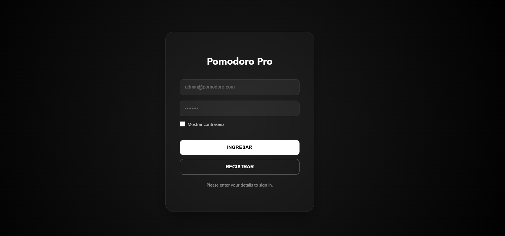
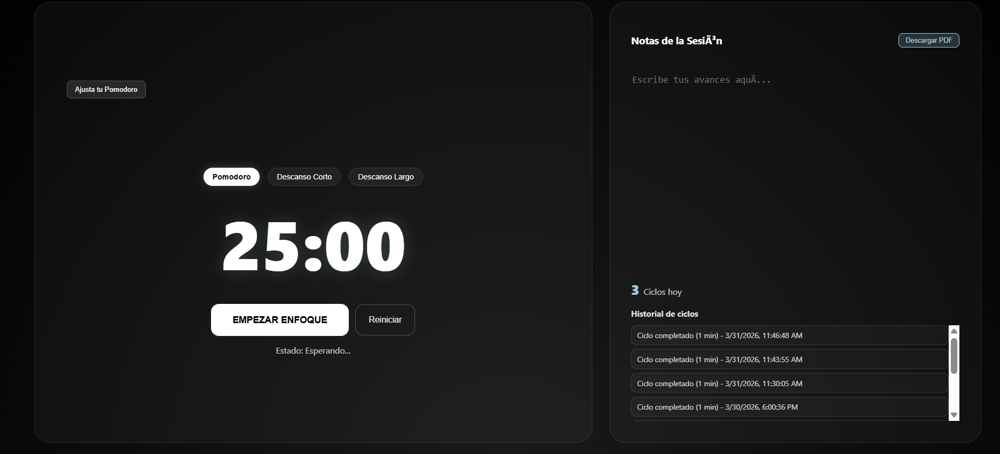
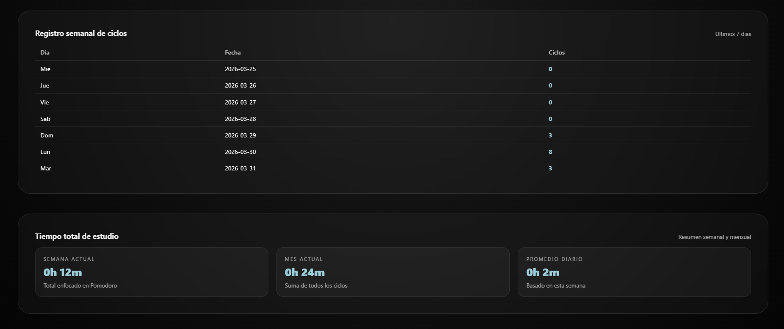

# TomaTask Front (HTML, CSS, JavaScript)



Interfaz web del proyecto TomaTask: login, registro y dashboard con temporizador, descansos y estadísticas.

## Tecnologías

- HTML5
- CSS3
- JavaScript (Vanilla)
- jsPDF (CDN) para exportar notas en PDF

## Estructura

```text
pomodoro-front/
  index.html
  src/
    pages/
      login.html
      register.html
    js/
      main.js
      modules/
        auth.js
        register.js
    css/
      home.css
      login.css
      register.css
```

## Requisitos

- XAMPP con Apache activo
- Backend `pomodoro-back` disponible como carpeta hermana en `htdocs`

Estructura esperada:

```text
c:\xampp\htdocs\
  pomodoro-front\
  pomodoro-back\
```

## Ejecución local

1. Iniciar Apache y MySQL en XAMPP.
2. Confirmar que el backend responda:
   - `http://localhost/pomodoro-back/api/v1/login.php`
3. Abrir el login del frontend:
   - `http://localhost/pomodoro-front/src/pages/login.html`

## Conexión con backend

El frontend consume:

- `../../../pomodoro-back/api/v1/login.php`
- `../../../pomodoro-back/api/v1/register.php`

Estas rutas están configuradas en:

- `src/js/modules/auth.js`
- `src/js/modules/register.js`

## Funcionalidades principales

- Login y registro de usuarios.
- Dashboard Pomodoro con modos:
  - Pomodoro
  - Descanso corto
  - Descanso largo
- Conteo de ciclos:
  - Al finalizar Pomodoro muestra modal con botón `OK`.
  - `OK` cambia a descanso corto.
  - Cada 4 pomodoros, cambia a descanso largo.
- Sonido de cuenta regresiva en los últimos 5 segundos.
- Sonido de fin de bloque.
- Historial y métricas de estudio (localStorage).
- Descarga de notas en PDF.

## Galería

### Dashboard



### Identidad visual



## Usuario de prueba

Si ejecutas `seed_user.php` en backend:

- Usuario/Email: `admin@pomodoro.com`
- Password: `123456`

## Notas

- El usuario logueado se guarda en `sessionStorage`.
- El historial de ciclos y modal de introducción usan `localStorage`.
- Si cambias nombres de carpetas, ajusta las rutas de `fetch` en módulos de auth/registro.
